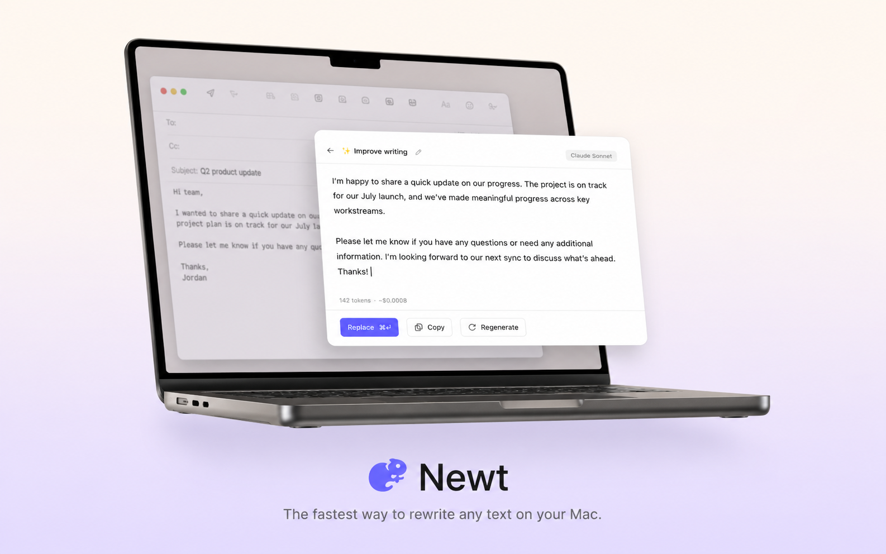
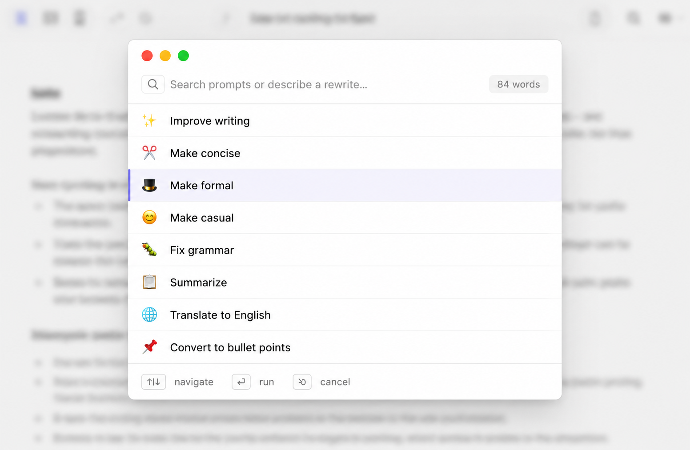
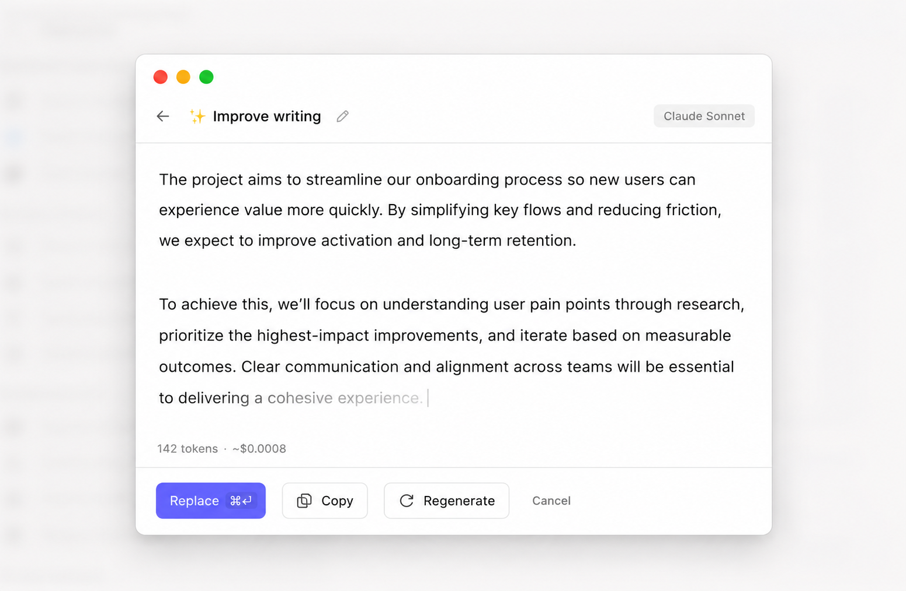
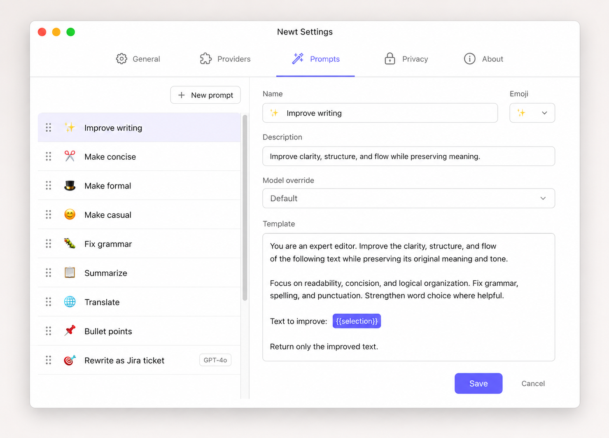

<div align="center">

# Newt

**Open-source AI rewriting for macOS. Your prompts, your keys, your Mac.**

Select text anywhere — a doc, a Slack message, an email, a code comment — press <kbd>⌘</kbd>+<kbd>;</kbd>, pick a prompt, and rewrite in place.

[](#status)
[](LICENSE)
[](#)



</div>

---

## Status

> 🚧 **Pre-alpha — building in public.** The product spec and visual design are locked. Code is in active development. Follow the journey and pre-register for the launch:
>
> - 📐 Read the [full PRD](./product/Newt-PRD.md)
> - 🖼 Browse the [design mockups](./product/screens/)
> - 🐦 Follow [@thebogdan_](https://x.com/thebogdan_) for build updates
> - ✉️ [Get notified at launch](#)

---

## What is Newt?

Newt is a lightweight macOS menu bar app for AI-powered rewriting. It works in any app that supports standard copy and paste — Notion, Slack, Gmail, Linear, Google Docs, Mail, Messages, your IDE, your terminal — without any per-app integration.

You bring your own API key (OpenAI or Anthropic for v1, local models and any OpenAI-compatible endpoint coming next). Selected text never leaves your machine until you trigger a rewrite, and even then only to the provider you chose.

The whole thing is built around two ideas: **prompts as first-class objects** that you can edit, share, and version, and a **lightweight footprint** — under 20 MB on disk, under 50 MB of RAM at idle, and zero CPU when you're not rewriting.

## How it works

<table>
<tr>
<td width="50%">

**1. Select text and trigger Newt**

Highlight text in any app, then press <kbd>⌘</kbd>+<kbd>;</kbd> or right-click → *Rewrite with Newt*.

</td>
<td width="50%">



</td>
</tr>
<tr>
<td width="50%">

**2. Pick a prompt**

Search the prompt library or use a built-in one. Hit Enter to run.

</td>
<td width="50%">



</td>
</tr>
<tr>
<td width="50%">

**3. Replace, copy, or regenerate**

The rewrite streams in. Press <kbd>⌘</kbd>+<kbd>↵</kbd> to replace the original selection in place.

</td>
<td width="50%">



</td>
</tr>
</table>

## Why Newt

- **Works everywhere on your Mac.** Any app with copy/paste — including Electron apps, web apps, and IDEs where most "AI for writing" tools fail.
- **Bring your own key.** Free forever with OpenAI, Anthropic, or local models via Ollama. A hosted Newt Cloud tier is coming for users who'd rather not manage keys.
- **Custom prompts as first-class.** Plain-text files you can edit, version, and share. Ship a "rewrite as a Jira ticket" or a "make it a haiku" prompt with two clicks.
- **Private by default.** No telemetry without opt-in. Your text only leaves the device when you invoke a rewrite, and only to your chosen provider.
- **Open source.** Apache 2.0. Public roadmap, public stats, public issue tracker.
- **Fast and small.** Built on Rust + Tauri. Under 20 MB on disk, under 50 MB RAM at idle.

## Tech stack

- **Core engine + CLI**: Rust
- **UI**: Tauri (Rust + web frontend)
- **macOS integration**: Objective-C / Swift bridges where needed
- **Auto-update**: Sparkle
- **Distribution**: Notarized DMG via GitHub Releases + Homebrew cask

See [the PRD](./product/Newt-PRD.md#6-tech-stack) for the full reasoning.

## Roadmap

Newt is being built in small, demoable phases. Each phase ships a working artifact before the next one starts.

- **Phase 0** — CLI foundation, prompt store, config
- **Phase 1** — End-to-end rewrite pipeline (mock provider)
- **Phase 2** — Real BYOK providers (OpenAI + Anthropic)
- **Phase 3** — Menu bar app and settings UI
- **Phase 4** — Selection capture, hotkey, result popup ← *the magic*
- **Phase 5** — macOS Services menu integration
- **Phase 6** — Notarized DMG + Homebrew distribution
- **Phase 7** — Opt-in telemetry and public stats
- **Phase 8** — Local (Ollama) and OpenAI-compatible providers

Future: Newt Cloud (hosted), Windows port, Linux, richer context awareness.

Full milestone detail in the [PRD §9](./product/Newt-PRD.md#9-phased-milestones).

## Installation

> Not yet — we're pre-alpha. Once Phase 6 ships, install will be:
>
> ```sh
> brew install --cask newt
> ```
>
> Or download a notarized `.dmg` from [Releases](https://github.com/bogdan-pistol/newt-app/releases).

## Building from source

> Coming with Phase 0. Will be the standard `cargo` + `pnpm` flow for a Tauri app. Watch this section.

## Contributing

The repo is public from day zero so the design and decisions are visible — but it's not yet open to PRs while the foundation lands. Once Phase 1 ships, contributing guidelines and good-first-issue labels will arrive together.

In the meantime, the most useful things you can do:

- ⭐ Star the repo if you'd use this
- 💬 [Open a discussion](https://github.com/bogdan-pistol/newt-app/discussions) with prompt ideas, edge cases, or apps you'd want it to work in
- 🐛 [File an issue](https://github.com/bogdan-pistol/newt-app/issues) if you spot something off in the PRD or designs
- 🐦 Reply to build updates on [@thebogdan_](https://x.com/thebogdan_)


## License

[Apache 2.0](LICENSE) © 2026 Your Name

---

<div align="center">

Built with care in public.
[Read the PRD](./product/Newt-PRD.md) · [Browse the screens](./product/screens/) · [Follow on X](https://x.com/thebogdan_)

</div>
